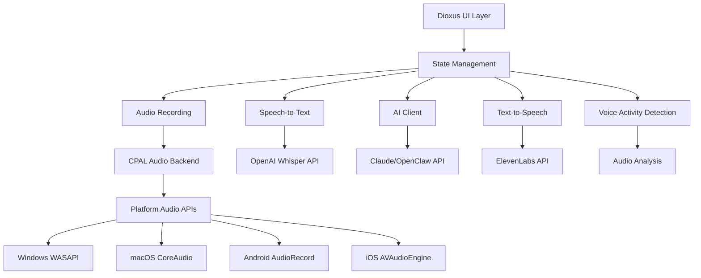

# 설계 문서

## 개요

ClawToTalk 웹 애플리케이션을 Dioxus 0.7을 사용하여 크로스 플랫폼 네이티브 애플리케이션으로 변환합니다. 이 설계는 단일 Rust 코드베이스로 Windows, Mac, Android, iOS에서 실행되는 음성 어시스턴트 앱을 구축하는 것을 목표로 합니다.

Dioxus는 React와 유사한 선언적 UI 패러다임을 제공하며, RSX 문법을 통해 컴포넌트 기반 아키텍처를 지원합니다. 최신 0.7 버전은 신호 기반 상태 관리, 핫 리로딩, 그리고 강화된 모바일 지원을 제공합니다.

## 아키텍처

### 전체 아키텍처



### 레이어 구조

1. **UI Layer (Dioxus)**: 크로스 플랫폼 사용자 인터페이스
2. **State Management**: 신호 기반 전역 상태 관리
3. **Audio Layer**: 음성 녹음, 재생, 분석
4. **API Layer**: 외부 서비스와의 통신
5. **Platform Layer**: 플랫폼별 네이티브 기능

## 컴포넌트 및 인터페이스

### 1. 메인 애플리케이션 컴포넌트

```rust
// 의사코드
struct App {
    state: AppState,
    audio_manager: AudioManager,
    api_client: ApiClient,
}

struct AppState {
    recording_mode: Signal<RecordingMode>,
    is_recording: Signal<bool>,
    conversation_history: Signal<Vec<Message>>,
    settings: Signal<Settings>,
    current_status: Signal<AppStatus>,
}
```

### 2. 오디오 관리자

```rust
// 의사코드
trait AudioManager {
    async fn start_recording(&self) -> Result<(), AudioError>;
    async fn stop_recording(&self) -> Result<Vec<u8>, AudioError>;
    async fn play_audio(&self, data: &[u8]) -> Result<(), AudioError>;
    fn get_audio_level(&self) -> f32;
    fn request_permissions(&self) -> Result<(), PermissionError>;
}

struct CrossPlatformAudioManager {
    cpal_device: Device,
    recording_stream: Option<Stream>,
    playback_stream: Option<Stream>,
    vad_detector: VoiceActivityDetector,
}
```

### 3. API 클라이언트

```rust
// 의사코드
struct ApiClient {
    whisper_client: WhisperClient,
    ai_client: AiClient,
    tts_client: TtsClient,
}

trait SpeechToText {
    async fn transcribe(&self, audio: &[u8]) -> Result<String, ApiError>;
}

trait AiAssistant {
    async fn generate_response(&self, prompt: &str) -> Result<String, ApiError>;
}

trait TextToSpeech {
    async fn synthesize(&self, text: &str) -> Result<Vec<u8>, ApiError>;
}
```

### 4. 음성 활동 감지기

```rust
// 의사코드
struct VoiceActivityDetector {
    threshold: f32,
    window_size: usize,
    silence_duration: Duration,
}

impl VoiceActivityDetector {
    fn analyze_frame(&mut self, audio_frame: &[f32]) -> VadResult;
    fn is_speech_detected(&self) -> bool;
    fn reset(&mut self);
}
```

## 데이터 모델

### 1. 메시지 모델

```rust
// 의사코드
#[derive(Clone, Debug, Serialize, Deserialize)]
struct Message {
    id: Uuid,
    content: String,
    message_type: MessageType,
    timestamp: DateTime<Utc>,
    audio_data: Option<Vec<u8>>,
}

#[derive(Clone, Debug, Serialize, Deserialize)]
enum MessageType {
    User,
    Assistant,
    System,
    Error,
}
```

### 2. 설정 모델

```rust
// 의사코드
#[derive(Clone, Debug, Serialize, Deserialize)]
struct Settings {
    api_keys: ApiKeys,
    recording_mode: RecordingMode,
    vad_settings: VadSettings,
    audio_settings: AudioSettings,
}

#[derive(Clone, Debug, Serialize, Deserialize)]
struct ApiKeys {
    openai_key: Option<String>,
    claude_key: Option<String>,
    elevenlabs_key: Option<String>,
}

#[derive(Clone, Debug, Serialize, Deserialize)]
enum RecordingMode {
    Hold,
    Toggle,
    Auto,
}
```

### 3. 애플리케이션 상태

```rust
// 의사코드
#[derive(Clone, Debug)]
enum AppStatus {
    Idle,
    Recording,
    Processing,
    Speaking,
    Error(String),
}

#[derive(Clone, Debug)]
struct AudioLevel {
    current: f32,
    peak: f32,
    average: f32,
}
```

## 플랫폼별 구현

### 1. 데스크톱 (Windows/Mac/Linux)

- **오디오**: CPAL을 통한 WASAPI/CoreAudio/ALSA 사용
- **권한**: 시스템 권한 대화상자 자동 처리
- **파일 시스템**: 설정을 로컬 앱 데이터 디렉토리에 저장
- **네트워킹**: reqwest를 통한 HTTP 클라이언트

### 2. 모바일 (Android/iOS)

- **오디오**: 플랫폼별 네이티브 오디오 API 바인딩
- **권한**: 런타임 권한 요청 시스템
- **저장소**: 플랫폼별 보안 저장소 사용
- **백그라운드**: 제한된 백그라운드 처리 지원

### 3. 웹 (선택적)

- **오디오**: Web Audio API 및 MediaRecorder API
- **권한**: 브라우저 권한 API
- **저장소**: LocalStorage/IndexedDB
- **제한사항**: 브라우저 보안 정책 준수

## 상태 관리 전략

### Dioxus 신호 시스템

```rust
// 의사코드
// 전역 상태
static RECORDING_STATE: GlobalSignal<bool> = Signal::global(|| false);
static CONVERSATION: GlobalSignal<Vec<Message>> = Signal::global(Vec::new);
static SETTINGS: GlobalSignal<Settings> = Signal::global(Settings::default);

// 컴포넌트 레벨 상태
fn RecordingButton() -> Element {
    let mut is_recording = use_signal(|| false);
    let mut audio_level = use_signal(|| 0.0f32);
    
    // 상태 업데이트 로직
    rsx! {
        button {
            class: if is_recording() { "recording" } else { "idle" },
            onclick: move |_| {
                is_recording.toggle();
                // 녹음 시작/중지 로직
            },
            "Record"
        }
    }
}
```

### 비동기 작업 관리

```rust
// 의사코드
fn use_audio_recording() -> (Signal<bool>, impl Fn()) {
    let mut is_recording = use_signal(|| false);
    
    let toggle_recording = move || {
        spawn(async move {
            if is_recording() {
                // 녹음 중지 및 처리
                let audio_data = stop_recording().await?;
                let transcript = transcribe_audio(audio_data).await?;
                let response = get_ai_response(transcript).await?;
                let audio_response = synthesize_speech(response).await?;
                play_audio(audio_response).await?;
            } else {
                // 녹음 시작
                start_recording().await?;
            }
            is_recording.toggle();
        });
    };
    
    (is_recording, toggle_recording)
}
```

## 정확성 속성

*속성(Property)은 시스템의 모든 유효한 실행에서 참이어야 하는 특성이나 동작입니다. 본질적으로 시스템이 무엇을 해야 하는지에 대한 형식적 명세입니다. 속성은 사람이 읽을 수 있는 명세와 기계가 검증할 수 있는 정확성 보장 사이의 다리 역할을 합니다.*

### 속성 반영

프리워크 분석을 검토한 결과, 다음과 같은 중복성을 식별했습니다:

- 속성 2.2, 2.3, 2.4는 모두 녹음 모드별 동작을 테스트하므로 하나의 포괄적인 속성으로 통합 가능
- 속성 3.1과 8.4는 모두 라운드트립 속성으로 통합 가능
- 속성 4.1, 5.1은 API 사용 검증으로 통합 가능
- 성능 관련 속성 10.1, 10.2는 별도 유지 (각각 고유한 검증 가치 제공)

### 핵심 속성들

**속성 1: 녹음 모드 동작 일관성**
*모든* 녹음 모드(Hold, Toggle, Auto)에 대해, 선택된 모드에 따라 녹음 시작과 종료가 올바른 조건에서 발생해야 합니다
**검증: 요구사항 2.2, 2.3, 2.4**

**속성 2: 오디오 데이터 라운드트립**
*모든* 유효한 오디오 데이터에 대해, 녹음 → 저장 → 로드 → 재생 과정을 거쳐도 동등한 오디오 품질을 유지해야 합니다
**검증: 요구사항 3.1, 8.4**

**속성 3: API 통신 일관성**
*모든* 유효한 입력에 대해, 각 API 클라이언트(Whisper, Claude/OpenClaw, ElevenLabs)는 올바른 엔드포인트를 사용하고 적절한 응답을 반환해야 합니다
**검증: 요구사항 4.1, 4.2, 5.1**

**속성 4: 음성 활동 감지 정확성**
*모든* 오디오 입력에 대해, VAD 감지기는 실제 음성과 배경 소음을 구분하고, 음성 감지 시 자동으로 녹음을 시작하며, 음성 중단 후 설정된 지연 시간 후 녹음을 종료해야 합니다
**검증: 요구사항 6.1, 6.2, 6.3, 6.4**

**속성 5: 플랫폼별 권한 처리**
*모든* 지원 플랫폼에서, 마이크 및 기타 필요한 권한이 올바르게 요청되고 관리되어야 합니다
**검증: 요구사항 1.4, 2.5**

**속성 6: 오류 처리 완전성**
*모든* 오류 상황(네트워크 오류, 유효하지 않은 API 키, 권한 거부)에 대해, 적절한 오류 메시지가 표시되고 복구 방법이 제공되어야 합니다
**검증: 요구사항 9.1, 9.2, 9.3**

**속성 7: UI 상태 동기화**
*모든* 애플리케이션 상태 변경에 대해, UI는 즉시 새로운 상태를 반영해야 합니다 (녹음 중 시각적 피드백, 설정 변경 적용 등)
**검증: 요구사항 7.3, 8.5**

**속성 8: 입력 처리 포괄성**
*모든* 사용자 입력 방식(터치, 마우스, 키보드)에 대해, 애플리케이션은 일관되게 반응해야 합니다
**검증: 요구사항 7.2**

**속성 9: 성능 요구사항 준수**
*모든* 앱 시작에 대해 3초 이내에 완료되어야 하고, *모든* 녹음 시작 요청에 대해 100ms 이내에 응답해야 합니다
**검증: 요구사항 10.1, 10.2**

**속성 10: 자동 재시도 메커니즘**
*모든* 일시적 오류에 대해, 시스템은 설정된 재시도 정책에 따라 자동으로 재시도를 수행해야 합니다
**검증: 요구사항 9.4**

## 오류 처리

### 1. 오디오 관련 오류

```rust
// 의사코드
#[derive(Debug, Clone)]
enum AudioError {
    DeviceNotFound,
    PermissionDenied,
    RecordingFailed(String),
    PlaybackFailed(String),
    UnsupportedFormat,
}

impl AudioError {
    fn user_message(&self) -> String {
        match self {
            AudioError::DeviceNotFound => "오디오 장치를 찾을 수 없습니다".to_string(),
            AudioError::PermissionDenied => "마이크 권한이 필요합니다".to_string(),
            AudioError::RecordingFailed(msg) => format!("녹음 실패: {}", msg),
            AudioError::PlaybackFailed(msg) => format!("재생 실패: {}", msg),
            AudioError::UnsupportedFormat => "지원되지 않는 오디오 형식입니다".to_string(),
        }
    }
    
    fn recovery_action(&self) -> RecoveryAction {
        match self {
            AudioError::PermissionDenied => RecoveryAction::RequestPermission,
            AudioError::DeviceNotFound => RecoveryAction::ShowDeviceSettings,
            _ => RecoveryAction::Retry,
        }
    }
}
```

### 2. API 관련 오류

```rust
// 의사코드
#[derive(Debug, Clone)]
enum ApiError {
    NetworkError(String),
    AuthenticationFailed,
    RateLimitExceeded,
    InvalidResponse(String),
    ServiceUnavailable,
}

impl ApiError {
    fn is_retryable(&self) -> bool {
        matches!(self, 
            ApiError::NetworkError(_) | 
            ApiError::RateLimitExceeded | 
            ApiError::ServiceUnavailable
        )
    }
    
    fn retry_delay(&self) -> Duration {
        match self {
            ApiError::RateLimitExceeded => Duration::from_secs(60),
            ApiError::NetworkError(_) => Duration::from_secs(5),
            ApiError::ServiceUnavailable => Duration::from_secs(30),
            _ => Duration::from_secs(1),
        }
    }
}
```

### 3. 전역 오류 처리 전략

```rust
// 의사코드
struct ErrorHandler {
    retry_policies: HashMap<ErrorType, RetryPolicy>,
    user_notifications: Signal<Vec<UserNotification>>,
}

impl ErrorHandler {
    async fn handle_error(&self, error: AppError) -> Result<(), AppError> {
        // 로깅
        log::error!("Application error: {:?}", error);
        
        // 사용자 알림
        self.notify_user(&error);
        
        // 재시도 로직
        if error.is_retryable() {
            self.schedule_retry(error).await
        } else {
            Err(error)
        }
    }
    
    fn notify_user(&self, error: &AppError) {
        let notification = UserNotification {
            message: error.user_message(),
            severity: error.severity(),
            recovery_actions: error.recovery_actions(),
        };
        
        self.user_notifications.with_mut(|notifications| {
            notifications.push(notification);
        });
    }
}
```

## 테스트 전략

### 이중 테스트 접근법

이 프로젝트는 포괄적인 커버리지를 위해 단위 테스트와 속성 기반 테스트를 모두 사용합니다:

- **단위 테스트**: 특정 예제, 엣지 케이스, 오류 조건 검증
- **속성 테스트**: 모든 입력에 대한 범용 속성 검증

### 단위 테스트 전략

단위 테스트는 다음에 집중합니다:
- 특정 예제와 엣지 케이스 (빈 오디오 데이터, 잘못된 API 키 등)
- 컴포넌트 간 통합 지점
- 플랫폼별 기능의 구체적인 동작
- 오류 조건과 복구 시나리오

속성 테스트는 다음에 집중합니다:
- 모든 입력에 대한 범용 속성
- 랜덤화를 통한 포괄적인 입력 커버리지
- 시스템 불변성 검증

### 속성 기반 테스트 구성

**테스트 라이브러리**: Rust의 `proptest` 크레이트 사용
**최소 반복 횟수**: 속성 테스트당 100회 (랜덤화로 인한)
**태그 형식**: **Feature: dioxus-voice-assistant, Property {번호}: {속성 텍스트}**

각 정확성 속성은 단일 속성 기반 테스트로 구현되어야 합니다.

### 테스트 예제

```rust
// 의사코드
use proptest::prelude::*;

#[cfg(test)]
mod tests {
    use super::*;
    
    // 단위 테스트 예제
    #[test]
    fn test_empty_audio_handling() {
        let audio_manager = AudioManager::new();
        let result = audio_manager.process_audio(&[]);
        assert!(matches!(result, Err(AudioError::UnsupportedFormat)));
    }
    
    // 속성 테스트 예제
    proptest! {
        // Feature: dioxus-voice-assistant, Property 1: 녹음 모드 동작 일관성
        #[test]
        fn test_recording_mode_consistency(
            mode in prop::sample::select(vec![RecordingMode::Hold, RecordingMode::Toggle, RecordingMode::Auto]),
            trigger_events in prop::collection::vec(any::<TriggerEvent>(), 1..10)
        ) {
            let mut voice_assistant = VoiceAssistant::new();
            voice_assistant.set_recording_mode(mode);
            
            for event in trigger_events {
                let result = voice_assistant.handle_trigger(event);
                // 모드에 따른 올바른 동작 검증
                match mode {
                    RecordingMode::Hold => {
                        // Hold 모드 동작 검증
                    },
                    RecordingMode::Toggle => {
                        // Toggle 모드 동작 검증
                    },
                    RecordingMode::Auto => {
                        // Auto 모드 동작 검증
                    }
                }
            }
        }
        
        // Feature: dioxus-voice-assistant, Property 2: 오디오 데이터 라운드트립
        #[test]
        fn test_audio_roundtrip(
            audio_data in prop::collection::vec(any::<u8>(), 1000..10000)
        ) {
            let audio_manager = AudioManager::new();
            
            // 녹음 시뮬레이션
            let recorded = audio_manager.simulate_recording(&audio_data).unwrap();
            
            // 저장
            let saved = audio_manager.save_audio(&recorded).unwrap();
            
            // 로드
            let loaded = audio_manager.load_audio(&saved).unwrap();
            
            // 재생 준비
            let playback_ready = audio_manager.prepare_playback(&loaded).unwrap();
            
            // 품질 검증 (예: 주파수 도메인 비교)
            assert!(audio_quality_equivalent(&audio_data, &playback_ready));
        }
    }
}
```

### 통합 테스트

```rust
// 의사코드
#[cfg(test)]
mod integration_tests {
    use super::*;
    
    #[tokio::test]
    async fn test_full_voice_interaction_flow() {
        let app = App::new_for_testing().await;
        
        // 1. 음성 녹음 시뮬레이션
        let audio_data = generate_test_audio();
        app.simulate_audio_input(audio_data).await;
        
        // 2. 음성-텍스트 변환 확인
        let transcript = app.get_last_transcript().await;
        assert!(!transcript.is_empty());
        
        // 3. AI 응답 생성 확인
        let ai_response = app.get_last_ai_response().await;
        assert!(!ai_response.is_empty());
        
        // 4. 텍스트-음성 변환 확인
        let tts_audio = app.get_last_tts_audio().await;
        assert!(!tts_audio.is_empty());
    }
}
```

### 플랫폼별 테스트

각 플랫폼에 대해 별도의 테스트 스위트를 구성:

```rust
// 의사코드
#[cfg(target_os = "windows")]
mod windows_tests {
    // Windows 특화 테스트
}

#[cfg(target_os = "macos")]
mod macos_tests {
    // macOS 특화 테스트
}

#[cfg(target_os = "android")]
mod android_tests {
    // Android 특화 테스트
}

#[cfg(target_os = "ios")]
mod ios_tests {
    // iOS 특화 테스트
}
```