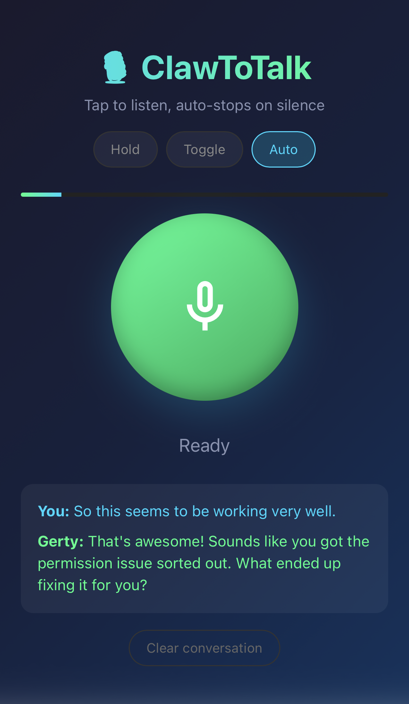

# 🎙️ ClawToTalk

A browser-based voice interface for AI assistants. Talk using your voice, get spoken responses back.

**Push-to-talk, toggle, or hands-free auto-detection** — works on desktop and mobile.

<p align="center">
  
</p>

## Features

- 🎤 **Three Recording Modes**
  - **Hold** — Push-to-talk (hold button while speaking)
  - **Toggle** — Tap to start, tap again to stop
  - **Auto** — Voice activity detection, auto-stops on silence
- 🗣️ **Natural Voice Responses** — ElevenLabs text-to-speech
- 🤖 **Two Backend Modes**
  - **OpenClaw Mode** — Full AI assistant with tools, memory, integrations
  - **Direct Mode** — Simple Claude API for standalone use
- 📱 **Mobile Friendly** — Works on iOS Safari and Android Chrome
- ⚡ **Fast** — ~3-6 second total latency

## How It Works

### OpenClaw Mode (Recommended)
```
[Your Voice] → [Whisper STT] → [OpenClaw Agent] → [ElevenLabs TTS] → [Speaker]
     🎤              📝              🧠🔧              🔊            🔈
```
Full AI assistant with access to tools, files, APIs, and memory.

### Direct Claude Mode
```
[Your Voice] → [Whisper STT] → [Claude API] → [ElevenLabs TTS] → [Speaker]
     🎤              📝            🧠              🔊            🔈
```
Simple conversational AI, no external tools.

## Quick Start

### Prerequisites

**Required for both modes:**
- [OpenAI API Key](https://platform.openai.com/api-keys) — for Whisper STT
- [ElevenLabs API Key](https://elevenlabs.io/) — for TTS

**For OpenClaw Mode (optional but recommended):**
- [OpenClaw](https://github.com/openclaw/openclaw) installed and running

**For Direct Mode:**
- [Anthropic API Key](https://console.anthropic.com/) — for Claude

### Installation

```bash
# Clone the repository
git clone https://github.com/ktamas77/clawtotalk.git
cd clawtotalk

# Install dependencies
npm install

# Copy environment template
cp .env.example .env

# Edit .env with your API keys
nano .env  # or use your preferred editor

# Start the server
npm start
```

### Open in Browser

Navigate to `http://localhost:3333`

## Configuration

### Direct Claude Mode (Default)

For standalone use without OpenClaw:

```bash
# .env
USE_OPENCLAW=false
OPENAI_API_KEY=sk-proj-...
ANTHROPIC_API_KEY=sk-ant-...
ELEVENLABS_API_KEY=...
ELEVENLABS_VOICE_ID=SAz9YHcvj6GT2YYXdXww
BOT_NAME=Assistant
```

### OpenClaw Mode

For full AI assistant capabilities (tools, memory, integrations):

```bash
# .env
USE_OPENCLAW=true
OPENAI_API_KEY=sk-proj-...
ELEVENLABS_API_KEY=...
ELEVENLABS_VOICE_ID=SAz9YHcvj6GT2YYXdXww
VOICE_SESSION_ID=voice-main
BOT_NAME=Gerty
```

Note: OpenClaw must be installed and the gateway must be running (`openclaw gateway start`).

### All Configuration Options

| Variable | Required | Default | Description |
|----------|----------|---------|-------------|
| `OPENAI_API_KEY` | Yes | - | OpenAI API key for Whisper STT |
| `ELEVENLABS_API_KEY` | Yes | - | ElevenLabs API key for TTS |
| `ELEVENLABS_VOICE_ID` | Yes | - | ElevenLabs voice ID |
| `USE_OPENCLAW` | No | `false` | Enable OpenClaw integration |
| `ANTHROPIC_API_KEY` | If direct mode | - | Anthropic API key for Claude |
| `VOICE_SESSION_ID` | No | `voice-clawtotalk` | OpenClaw session ID |
| `BOT_NAME` | No | `Assistant` | Display name in UI |
| `PORT` | No | `3333` | Server port |

### Choosing a Voice

Browse voices at [ElevenLabs Voice Library](https://elevenlabs.io/voice-library). 

Popular options:
- `SAz9YHcvj6GT2YYXdXww` — River (calm, neutral)
- `21m00Tcm4TlvDq8ikWAM` — Rachel (clear, American)
- `AZnzlk1XvdvUeBnXmlld` — Domi (expressive)

## Usage

### Recording Modes

| Mode | How to Use | Best For |
|------|------------|----------|
| **Hold** | Press and hold the button while speaking | Quick questions, noisy environments |
| **Toggle** | Tap to start recording, tap again to stop | Longer messages |
| **Auto** | Tap once, speak naturally, stops on silence | Hands-free conversation |

### Tips

- Speak clearly and at a normal pace
- Wait for the response to finish before speaking again
- On iOS, "Hold" mode is most reliable
- If audio doesn't play, tap the screen (iOS autoplay restriction)

## What is OpenClaw?

[OpenClaw](https://github.com/openclaw/openclaw) is an AI agent framework that gives your assistant:
- **Tools** — File access, web search, code execution, APIs
- **Memory** — Persistent context across conversations
- **Integrations** — Calendar, email, smart home, and more
- **Multi-channel** — Same assistant on Slack, Discord, WhatsApp, etc.

With OpenClaw mode enabled, ClawToTalk becomes a voice interface to your full AI assistant, not just a chatbot.

## API Endpoints

| Endpoint | Method | Description |
|----------|--------|-------------|
| `/` | GET | Web interface |
| `/health` | GET | Health check (includes mode) |
| `/api/config` | GET | Get bot configuration |
| `/api/voice` | POST | Process voice (multipart form with `audio` field) |
| `/api/clear` | POST | Clear conversation (direct mode only) |

## Deployment

### Local Network

Run `npm start` — accessible from any device on your network via local IP.

### Tailscale (Access from Anywhere)

```bash
# Expose via Tailscale Serve (within your tailnet)
tailscale serve 3333

# Access via https://your-machine.tailnet-name.ts.net/
```

### Docker

```dockerfile
FROM node:22-alpine
WORKDIR /app
COPY package*.json ./
RUN npm ci --only=production
COPY . .
EXPOSE 3333
CMD ["npm", "start"]
```

## Troubleshooting

### "Microphone access denied"
- Check browser permissions
- On iOS, ensure Safari has microphone access in Settings

### No audio playback on iOS
- Tap the screen after speaking — iOS blocks autoplay
- Try using Safari instead of a PWA

### OpenClaw mode not working
- Ensure OpenClaw gateway is running: `openclaw gateway status`
- Check that `openclaw agent --message "test" --json` works from terminal

### High latency
- OpenClaw mode is slower (~5-8s) due to full agent processing
- Direct mode is faster (~3-4s)
- ElevenLabs Turbo model helps with TTS speed

## Tech Stack

- **Backend:** Node.js, Express
- **STT:** OpenAI Whisper API
- **LLM:** Claude via OpenClaw or direct Anthropic API
- **TTS:** ElevenLabs
- **Frontend:** Vanilla HTML/CSS/JS, Web Audio API

## Contributing

Contributions welcome! Ideas:
- Wake word detection ("Hey Assistant")
- Streaming responses for lower latency
- Multiple voice options in UI
- WebSocket for real-time communication

## License

MIT License — use, modify, distribute freely.

## Credits

Built by [Tamas Kalman](https://github.com/ktamas77) and Gerty 🤖

Part of the [OpenClaw](https://github.com/openclaw/openclaw) ecosystem.
